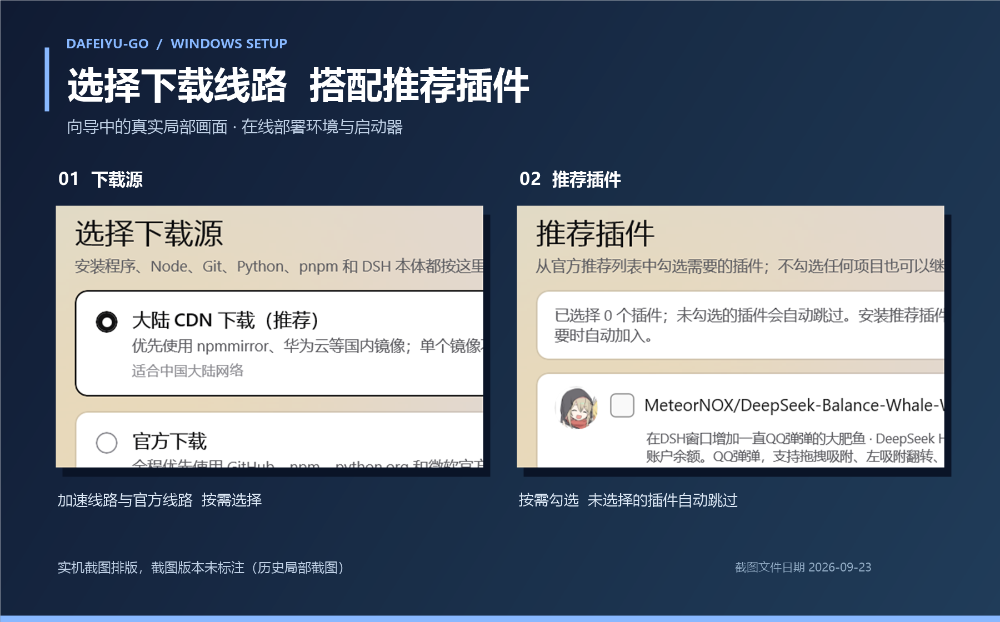

# 大肥鱼Go · Windows 安装器

**把 DeepSeek Harness 的环境检测、组件安装和启动器部署交给一个向导。**

[下载安装包](https://github.com/YunxiRamito/Dafeiyu-Go-DeepSeek-Harness-Setup/releases/latest) · [English](docs/README.en.md) · [配套启动器](https://github.com/YunxiRamito/Dafeiyu-Go-DeepSeek-Harness-Click-To-Run) · [MIT](LICENSE)



*实机截图排版，截图版本未标注（历史局部截图）；截图文件日期 2026-09-23，不代表当前版本界面。界面支持中文与英文，可在右上角切换。*

## 快速开始

1. 在 [Releases](https://github.com/YunxiRamito/Dafeiyu-Go-DeepSeek-Harness-Setup/releases/latest) 下载 `DSH-Installer-Setup.exe` 并运行。
2. 缺少运行库时，先确认下载与安装；按提示授予管理员权限。
3. 选择下载源、安装范围与目录，再按需选择 pnpm / Git / Python、推荐插件、快捷方式和自启。
4. 在确认页检查安装计划：目标目录、组件安装／复用、系统改动及提权原因；确认后点击「安装」。完成后通过启动器托盘或快捷方式打开 DSH。

已有且符合要求的组件会尽量复用；可选择强制重新下载。安装损坏时，可使用欢迎页的「修复安装」或 `--repair`。

## 安装前确认

| 项目 | 要求 |
| --- | --- |
| 系统 | Windows 10 1809（build 17763）或更新版本，x64 |
| 网络 | **在线安装**；DSH、启动器及缺失组件需要下载 |
| Node.js | 最低 22.13.0；缺失时下载 Node 22 系列便携版 |
| 运行库 | .NET 8 桌面运行时、Windows App Runtime 1.8；缺失或版本不足时由引导程序补齐 |

> 当前源码版本为 **1.5.2**，实际下载版本以 Releases 为准。安装器仍为框架依赖的 WinUI 3 应用，不是自包含离线包。

**便携组件，不等于零系统改动。**

- DSH 与启动器部署到所选目录；新下载的 Node / pnpm / Git / Python 使用便携版，不走 Node 系统 MSI 安装。
- 安装器会按范围写入 PATH、卸载注册表入口与安装记录，并按选项创建快捷方式、自启计划任务。
- 两个运行库是系统级安装。选择「所有用户」、启用自启、补装运行库或写入受保护目录时，需要管理员权限；启动器自身也可能触发 UAC。**不保证全程只弹一次。**
- 启动器在线读取发布清单，必要时尝试旧仓库及 GitHub API；加速线路还可从 npm 镜像下载。当前安装流程**没有内置 `payload\launcher.zip` 离线回退**，已有 Node 和运行库也不代表可以离线安装。

默认当前用户目录为 `%LOCALAPPDATA%\DeepSeek Harness`；所有用户目录为 `%ProgramFiles%\DeepSeek Harness`。兼容文件名和数据目录沿用旧协议，见 [过渡说明](TRANSITION.md)。

## 卸载与排障

在 Windows「应用和功能」中卸载，或运行安装目录中的 `DSH-Uninstall.exe`。卸载默认保留设置、技能、插件与会话数据；取消保留前请先备份。外部复用的组件不是本安装器下载的便携组件，两个系统运行库也不会随本体目录一起移除。

失败页和完成页可**导出安装日志**。分享前仍应检查是否包含私人路径或其他敏感信息，不要直接上传配置、凭据或完整状态文件。

| 位置 | 用途 |
| --- | --- |
| `%LOCALAPPDATA%\DeepSeekHarness\installer.log` | 安装日志 |
| `%LOCALAPPDATA%\DeepSeekHarness\installer-state.json` | 本机安装记录，排查路径或修复时参考 |
| `%TEMP%\dsh-boot.log` | 引导程序与运行库安装日志 |

下载失败时切换向导中的下载源，或检查代理设置；运行库安装失败时可手动安装后重试。

**官方构建目前未签名。** SmartScreen 警告不能证明文件安全或有害；先核对下载来源。确认来自本仓库 Releases 后，可选择「更多信息 → 仍要运行」，或在文件属性中「解除锁定」。详见 [签名说明](SIGNING.md)。

<details>
<summary><strong>命令行与无人值守安装</strong></summary>

发布安装包接受参数并转交主程序。`--silent` 跳过向导，但不会绕过 UAC；批量部署时应预先准备相应权限。

```powershell
# 当前用户安装，不注册自启，安装后不启动
.\DSH-Installer-Setup.exe --silent --scope=user --source=china --pnpm --git --no-autostart --no-launch --report=install.json

# 按已有安装记录进入修复流程；无记录时退回普通安装
.\DSH-Installer-Setup.exe --repair

# 预览页面（0 起编号）；仍可能写入日志、缓存与配置
.\DSH-Installer-Setup.exe --page=4
```

| 参数 | 用途 |
| --- | --- |
| `--silent` / `--uninstall` / `--repair` | 无向导安装 / 卸载 / 修复 |
| `--scope=user\|machine` | 当前用户 / 所有用户 |
| `--source=china\|official` | 加速线路 / 官方线路 |
| `--dsh-root=<路径>` | DSH 目录 |
| `--launcher-root=<路径>` | 启动器目录 |
| `--components-root=<路径>` | 便携组件目录 |
| `--pnpm` / `--git` / `--python` | 选择可选组件 |
| `--force-reinstall` | 对所选组件禁用复用，重新下载便携版 |
| `--no-shortcut` / `--no-autostart` / `--no-launch` | 不建桌面快捷方式 / 不注册自启 / 不在完成后启动 |
| `--no-runtime` | 跳过主安装流程的运行库步骤；**不禁用外层引导程序的运行库补装** |
| `--report=<文件>` | 写入 JSON 结果 |
| `--dry-run` | 演练主要安装步骤；**不是零写盘或隔离沙箱** |
| `--page=N` / `--lang=zh\|en` | 跳页预览 / 界面语言 |

`--page=N` 默认启用演练；同时传 `--install` 或 `--silent` 则允许真实安装。外层引导程序仍会解压安装器、记录日志并按需补装运行库；不要在未准备好的机器上把预览当作无副作用测试。

</details>

<details>
<summary><strong>从源码构建</strong></summary>

使用 Windows x64、.NET 8 SDK 与可用的 Windows SDK 构建环境。Windows App SDK `1.8.260804001` 由 NuGet 恢复；打包脚本还调用系统 .NET Framework 的 `csc.exe`。

```powershell
# 共享库
 dotnet build src\DshInstaller.Shared\DshInstaller.Shared.csproj -c Release

# WinUI 主程序
 dotnet build src\DshInstaller\DshInstaller.csproj -c Release

# 开发预览包
.\pack-preview.ps1

# 正式安装包：dist\DSH-Installer-Setup.exe，不复制到桌面
.\pack-release.ps1 -NoDesktop
```

打包脚本会清理输出并停止匹配的安装器进程，请先结束本机测试。DSH 安装范围为 `@deepseek-ai/dsh@^0.1.5-rc.1`，不是锁定的精确版本；版本与系统门槛参考 [构建配置](Directory.Build.props)。

维护入口：[交接说明](HANDOVER.md) · [1.5.0 功能交接](HANDOVER-1.5.0-installer.md) · [项目状态](STATUS.md) · [发布流程](RELEASE.md)。历史文档与实现不一致时，以当前源码和发布产物为准。

</details>
