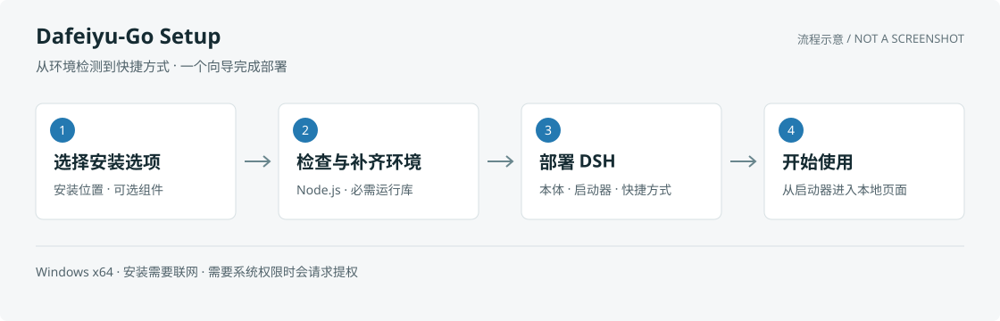

# Dafeiyu-Go · Windows Setup

**One wizard to check prerequisites, install DeepSeek Harness and deploy its tray launcher.**

[Download](https://github.com/YunxiRamito/Dafeiyu-Go-DeepSeek-Harness-Setup/releases/latest) · [中文](../README.md) · [Launcher](https://github.com/YunxiRamito/Dafeiyu-Go-DeepSeek-Harness-Click-To-Run) · [MIT](../LICENSE)



*Installation diagram, not a software screenshot. The wizard supports Chinese and English.*

## Get Started

1. Download `DSH-Installer-Setup.exe` from [Releases](https://github.com/YunxiRamito/Dafeiyu-Go-DeepSeek-Harness-Setup/releases/latest).
2. Run it. If runtimes are missing, approve their download and installation, including elevation when requested.
3. Choose your download source, scope and directories. Select optional pnpm / Git / Python, recommended plugins, shortcuts and autostart as needed.
4. Install, then start Dafeiyu-Go and open DSH through the tray or shortcut.

Suitable existing components are reused where possible. Use the welcome page's repair action or `--repair` to repair an existing installation.

## Requirements

| Item | Requirement |
| --- | --- |
| OS | Windows 10 1809 (build 17763) or newer, x64 |
| Network | Online installation; DSH, launcher and missing components require downloads |
| Node.js | At least 22.13.0; missing Node is installed as a portable Node 22 ZIP |
| Runtimes | .NET 8 Desktop Runtime and Windows App Runtime 1.8; the bootstrapper installs missing or insufficient runtimes |

The current source version is **1.5.3**; Releases determines the downloadable version. The WinUI 3 installer remains framework-dependent, not a self-contained offline bundle.

## What Changes

- DSH and the launcher go into the selected directories. Newly downloaded Node / pnpm / Git / Python are portable copies; Node is not installed through a system MSI.
- Setup writes PATH entries, uninstall registration and installation records, and creates shortcuts or an autostart task as selected. Portable components do **not** mean zero system changes.
- Machine scope, autostart, missing system runtimes and protected target directories require elevation. The launcher can also request elevation. There is **no guarantee of exactly one UAC prompt**.
- Launcher discovery uses the release manifest, with legacy-repository and GitHub API fallback. The accelerated source can use the npm mirror. The current installation flow has **no bundled `payload\launcher.zip` offline fallback**, even when Node and both runtimes already exist.

Default roots are `%LOCALAPPDATA%\DeepSeek Harness` for the current user and `%ProgramFiles%\DeepSeek Harness` for all users. Legacy filenames and data locations are retained for compatibility; see [transition notes](../TRANSITION.md).

## Uninstall And Troubleshooting

Use Windows **Apps & features**, or run `DSH-Uninstall.exe` from the installation directory. Settings, skills, plugins and sessions are retained by default; back them up before disabling retention. Reused external components and the two system runtimes are not portable files removed with the application directory.

The completion and failure pages can export logs. Review the bundle before sharing; do not upload credentials, configuration or the complete state file without checking it.

| Location | Purpose |
| --- | --- |
| `%LOCALAPPDATA%\DeepSeekHarness\installer.log` | Installation log |
| `%LOCALAPPDATA%\DeepSeekHarness\installer-state.json` | Local installation record used by repair |
| `%TEMP%\dsh-boot.log` | Bootstrapper and runtime installation log |

For download failures, change the source or check proxy settings. For runtime failures, install the required runtimes manually and retry.

Official builds are currently **unsigned**. A SmartScreen warning alone proves neither safety nor harm. Verify the download came from this repository's Releases before using **More info → Run anyway** or **Properties → Unblock**. See [signing policy](../SIGNING.md).

<details>
<summary><strong>CLI And Building</strong></summary>

```powershell
# Current-user installation without autostart or launch-after-install
.\DSH-Installer-Setup.exe --silent --scope=user --source=china --pnpm --git --no-autostart --no-launch --report=install.json

# Repair using the installation record; falls back to regular setup if absent
.\DSH-Installer-Setup.exe --repair

# Build on Windows with .NET 8 SDK and a Windows SDK build environment
 dotnet build src\DshInstaller\DshInstaller.csproj -c Release
.\pack-preview.ps1
.\pack-release.ps1 -NoDesktop
```

Windows App SDK `1.8.260804001` is restored through NuGet. Release packaging also uses the system .NET Framework `csc.exe`, cleans output and stops matching installer processes. Stop local testing before packaging.

`--silent` skips the wizard, not UAC. Directory switches are `--dsh-root=`, `--launcher-root=` and `--components-root=`. Select components with `--pnpm`, `--git`, `--python`; disable reuse with `--force-reinstall`. Other switches include `--uninstall`, `--source=china|official`, `--scope=user|machine`, `--no-shortcut`, `--no-autostart`, `--no-launch`, `--report=` and `--lang=zh|en`.

**Preview is not a zero-write sandbox.** `--dry-run` skips main installation actions, but logs, configuration or caches may still be written. `--page=N` uses zero-based page numbers and enables dry-run unless combined with `--install` or `--silent`. The outer bootstrapper still extracts setup and can install missing runtimes. `--no-runtime` skips the main application's runtime steps, not the bootstrapper's prerequisite installation.

The DSH package range is `@deepseek-ai/dsh@^0.1.5-rc.1`, not a pinned exact version. See [build configuration](../Directory.Build.props), the [full CLI table](../README.md), [handoff](../HANDOVER.md) and [release process](../RELEASE.md). Historical notes may describe older behavior; current source and release artifacts take precedence.

</details>
